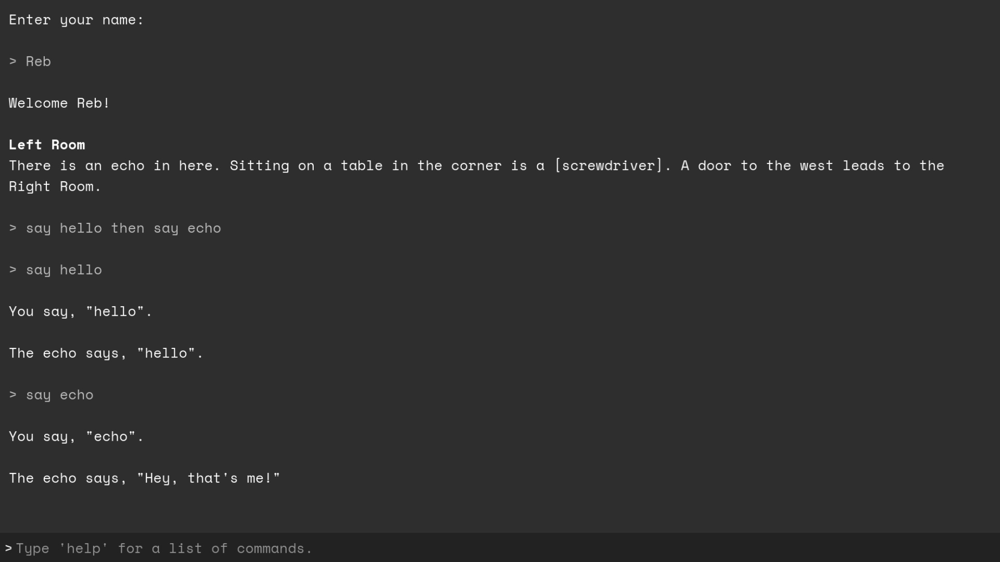

# Narrāre

A Godot-based framework for making text-based adventure games and interactive fiction!

<h2 align="center"><a href="https://github.com/RebUnderwood/Narrare">Get Narrāre!</a></h2>

# Warning: These docs are outdated! The dev is currently working to update them; we appreciate your patience.

Back in Ye Olden Days, games like [Zork](https://en.wikipedia.org/wiki/Zork) and [Anchorhead](https://en.wikipedia.org/wiki/Anchorhead) used the medium of text to create elaborate, interactive worlds. Through intuitive, natural language, players could interact with these worlds naturally, exploring them at their whim.

Nowadays, this genre of game has largely faded from the minds of all but the truly niche-minded, and part of the reason for that is that the tools for creating them have not evolved with the rest of the gaming landscape. The most popular software for producing interactive fiction, Inform 7, is very good at what it does, but does not offer the full capabilities of a modern game engine.

I developed Narrāre because I wanted to make text-based games that could do *more*. It's a framework for the Godot game engine that takes most of the difficult work of developing these types of games out of the equation, but because it's based in Godot, you get all the power and capabilities of Godot too. Custom interfaces, sprites, 3D animations, minigames—whatever you want to make, you can build it on top of Narrāre.

Narrāre is also designed with the technical-minded in mind. If you want to get into the nuts and bolts, you can. Create your own commands, implement complex logic, whatever you want to do.